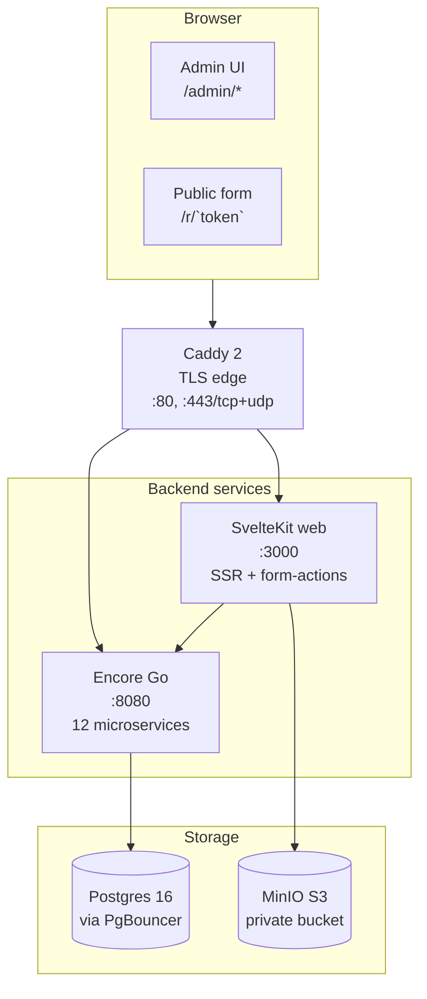

# SchoolRise — Architecture

A one-page tour of the system, written for a contributor who just cloned the repo.

---

## High-level shape

The stack is **two compute services + two storage services + one edge**. Everything else (the 12 Encore microservices, the seed scripts, the migration tooling) is detail.

---

## The 12 Encore microservices

Each service is a directory under `apps/`, owns its own Postgres database, and exposes HTTP endpoints declared with `//encore:api`.

| Service | DB | Owns |
|---|---|---|
| `auth` | `auth` | users, sessions, role assignments, password hashes |
| `tenancy` | `tenancy` | hierarchy nodes (country/region/district/institution), closure table |
| `people` | `people` | persons, students, staff |
| `academics` | `academics` | niveaux (grade levels), academic periods, classes, class_students, class_staff |
| `enrollment` | `enrollment` | enrollments, transfers, drops, coverage snapshots |
| `forms` | `forms` | forms, questions, form_versions (immutable snapshots), form_logic_rules |
| `assessment` | `assessment` | scales, scale_bands, campaigns, assignments, responses, scores |
| `progression` | `progression` | progression_snapshots (precomputed band counts per scope×campaign×period) |
| `ai` | `ai` | AI-assisted item generation jobs, BAML contracts |
| `imports` | `imports` | bulk CSV import jobs + row errors |
| `notifications` | `notifications` | email outbox, audit |
| `setup` | `setup` | first-boot installation wizard state |

Cross-service calls use Encore's auto-generated client (e.g. `enrollment.GetActiveEnrollment(ctx, ...)` in progression's code is a real RPC, traced automatically). The 12-database split is enforced by Encore — no service can directly query another's tables.

### Why so many services?

Each one models a distinct **bounded context** with its own schema lifecycle. When the assessment service adds a new field to `scores`, the people service is unaffected. Migrations are per-service. This is what makes the snapshot system feasible at 4.3 M-row scale: the progression service caches aggregates locally without coupling to people's row format.

---

## Request lifecycle: an admin opens the form editor

1. **Browser** GETs `https://<DOMAIN>/admin/forms/10`
2. **Caddy** (TLS termination) forwards to `web:3000` over the internal Docker network
3. **SvelteKit** runs `apps/web/src/routes/admin/forms/[id]/+page.server.ts::load`
4. The load fn calls `getForm({ token }, 10)` → `GET app:8080/v1/forms/items/10` (Encore)
5. Encore's `apps/forms/api.go::GetFormAPI` validates the session, queries `forms.questions` via sqlc, returns DTO
6. SvelteKit renders the 3-panel editor (`+page.svelte`) with the questions array
7. The browser receives streamed HTML + hydration state; `field-palette.svelte`, `form-canvas.svelte`, `field-settings-drawer.svelte` mount

When the admin **drags a question to reorder**, `form-canvas.svelte` triggers a hidden form submission with `ordered_ids=...`. SvelteKit's `?/reorderQuestion` action runs server-side, fetches the current questions, then PUTs each one with the new `sort_order` (the backend requires full payloads, not partial updates — this is documented in `apps/forms/api.go:230`).

When the admin **adds a logic rule** ("show Q3 if Q1=yes"), the rule is stored in `forms.settings.logic_rules` JSONB. On `?/publish`, the rule travels with the snapshot into `form_versions.snapshot.settings.logic_rules`. The public renderer at `/r/[token]` evaluates rules client-side via `apps/web/src/lib/forms/logic.ts::computeVisibleQuestions`.

---

## Request lifecycle: a respondent submits a form

1. Respondent visits `https://<DOMAIN>/r/abc123token` (the assignment URL)
2. SvelteKit's `apps/web/src/routes/r/[token]/+page.server.ts::load` looks up the assignment via Encore (`/v1/responses/lookup`), fetches the form_version snapshot
3. The page renders the questions; logic rules reactively hide/show via `$derived` on the local `answers` state
4. For each `<FileUploadInput>`, the browser POSTs to `/api/uploads` (a SvelteKit endpoint, not Encore). That endpoint (`apps/web/src/routes/api/uploads/+server.ts`) validates content-type + size, generates a key like `uploads/2026/05/<uuid>.png`, streams to MinIO via the AWS S3 SDK, returns `{ key, url }` where `url` is `/api/uploads/<key>` — a same-origin path served by the proxy at `apps/web/src/routes/api/uploads/[...key]/+server.ts`
5. The respondent submits the form. SvelteKit's `?/submit` action POSTs to Encore's `/v1/responses` with the answer payload (including MinIO keys for any uploaded files)
6. Encore stores the response + computes a raw_score; the campaign's scale_bands map raw_score → band_code
7. The next progression-snapshot refresh (cron-driven, ~5 min cadence in production) recomputes the aggregate

---

## How the snapshot system makes the dashboard fast

`apps/progression/progression.go` originally did a 94K-call N+1 enrollment lookup per dashboard request. At 4.3 M-row ministry-scale this took 60 s and timed out under concurrent load.

The fix lives in two places:

1. **Code change** — `ComputeProgression` now batch-fetches enrollments via `ListActiveStudentsInScope(ctx, institutionIDs, periodID)` (one SQL query instead of 94 K).
2. **Schema** — `progression_snapshots` table (`scope_node_id, period_id, campaign_id, band_code, student_count`). A cron worker calls `RefreshSnapshot(ctx, scope, period, campaign)` every 5 min; the dashboard reads from snapshots, falling back to compute-on-miss.

For seeding 101 K snapshot rows in 1.2 s on the dev box, see `tools/loadtest/REPORT.md` and the bulk-SQL approach documented there.

---

## File storage: why MinIO is private-only in production

In dev (`docker-compose.local.yml`), MinIO exposes ports `:9000` (S3 API) and `:9001` (web console) on the host so you can debug uploads via the browser console.

In production (`deploy/compose/minio.yml`), **no host port mapping**. MinIO is reachable only from the Docker `schoolrise-net` network. Browsers never see MinIO's hostname. All file fetches resolve to `https://<DOMAIN>/api/uploads/<key>`, served by SvelteKit's proxy. Three benefits:

1. **No anonymous-download exposure** — even if a key leaks, only an authenticated session can fetch it.
2. **No CORS** — the public URL is same-origin.
3. **MinIO can be shared** — other apps on the same box join `schoolrise-net` and reach `minio:9000` directly with their own bucket prefix.

The MinIO console for ops is reached via SSH tunnel: `ssh -L 9001:schoolrise-minio:9001 server`.

---

## Custom Encore-Go fork

The Encore CLI's standard build sets `StaticLink: true` in `cli/daemon/export/export.go`. This breaks BAML's cgo runtime on aarch64 Linux (glibc static-TLS budget exhaustion under Apple Silicon Docker).

We maintain a fork of Encore with two lines patched:
- `cli/daemon/export/export.go`: `StaticLink: true` → `false`
- `v2/compiler/build/build.go`: emits `CGO_ENABLED=1` when build.CgoEnabled is set

The patched `schoolrise-app:patched` Docker image is built via the steps in **[docs/encore-go-build.md](encore-go-build.md)**. CI will build + push to `ghcr.io/formswrite/schoolrise-app` once item #9 from the production roadmap lands.

---

## Multi-compose deploy topology

Each prod concern is its own Docker Compose project, joined by a single external network `schoolrise-net`:

| Project | File | Lifecycle |
|---|---|---|
| postgres + pgbouncer | `deploy/compose/postgres.yml` | restart independent of all others |
| minio + bucket-init | `deploy/compose/minio.yml` | shared with future apps via `schoolrise-net` |
| encore app | `deploy/compose/app.yml` | restart for service deploys |
| sveltekit web | `deploy/compose/web.yml` | restart for UI deploys |
| caddy edge | `deploy/compose/caddy.yml` | only host-port owner (80, 443/tcp+udp) |

`make prod-up` brings them all up in order. `make prod-down` tears down in reverse. Each service's volumes are named (`pgdata-prod`, `minio-data-prod`, `caddy-data`, `caddy-config`) and survive lifecycle ops.

---

## Where to look when…

| If you want to… | Read |
|---|---|
| Understand the form editor 3-panel architecture | `apps/web/src/routes/admin/forms/[id]/+page.svelte` and the components under `apps/web/src/lib/components/forms/` |
| Trace a logic rule from authoring → evaluation | `logic-panel.svelte` → `?/createLogicRule` action → `forms.settings.logic_rules` JSONB → `PublishForm` snapshot → `apps/web/src/lib/forms/logic.ts::computeVisibleQuestions` |
| Trace a file upload | `<FileUploadInput>` → `POST /api/uploads` → `apps/web/src/lib/server/minio.ts::uploadStream` → MinIO `schoolrise-uploads` bucket → `<input type="hidden" name="q_<cid>" value="<key>">` → form `?/submit` |
| Add a new field type | `apps/web/src/lib/forms/field-types.ts` (registry) → `field-preview.svelte` (canvas inline preview) → `field-settings-drawer.svelte` (per-type settings) → `apps/web/src/routes/r/[token]/+page.svelte` (public renderer branch) → optionally `apps/forms/fieldtypes.go` (backend validation) |
| Run the full test suite | `cd apps/web && npx playwright test` (34 e2e) + `go test ./apps/...` |
| Bootstrap the production stack | [`deploy/README-prod.md`](../deploy/README-prod.md) |

---

## Decisions worth knowing

- **JSONB for extensibility** — `questions.extra`, `questions.validation`, `questions.grading`, `forms.settings` are all JSONB. New features (like logic rules in Phase 2) ride existing JSONB columns instead of new tables. Cost: less type safety. Benefit: features ship without schema migrations.
- **`client_id` (random UUID) on every question** — survives reorders + edits. Logic rules reference `target_question_client_id` (stable), never `sort_order` (changes on drag-reorder). Same pattern as FormSG.
- **Form versions are immutable snapshots** — once `?/publish` runs, the entire form (questions + logic + settings) is serialized into `form_versions.snapshot` JSONB. Public renderers read from snapshots, not live questions, so editing a published form doesn't retroactively change what respondents already saw.
- **The respondent never knows MinIO exists** — same-origin proxy is the only file URL pattern. This makes the system portable to AWS S3, Cloudflare R2, or Backblaze B2 by changing two env vars.
- **TLS only on the real domain** — no `*.localhost`, no `schoolrise.local`, no fake DNS for local TLS testing. Local dev is HTTP. Production is HTTPS. Simpler than supporting both.
